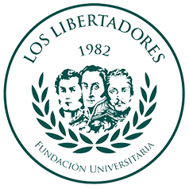

# Regresión Aplicada

## [Prof. Sébastien Lozano Forero](https://www.linkedin.com/in/s%C3%A9bastien-lozano-forero-5501476a/)  (*slozanof@libertadores.edu.co*)

Este video debe ser escuchado **inmediatamente** [click aquí](https://www.youtube.com/watch?v=H6Cb3oeHjqc&ab_channel=TheSoulflytriber)

Inline-style: 

En este repositorio, se encuentra alojado el material para el curso Regresión Aplicada de la EEAMV de FULL.

A continuación, una breve descripción de los contenidos aquí alojados: 

i. Sílabo del espacio académico

ii. Guía de Aprendizaje

iii. Notebooks para las clases

iv. Repositorio de proyectos

v. Recursos adicionales del espacio. 
